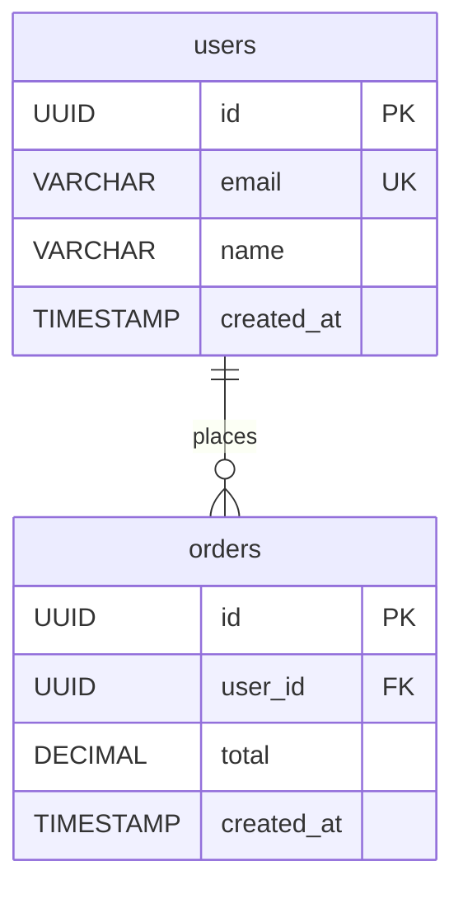

# 웹서비스 제작 및 배포 전문가를 위한 에이전트 & 스킬 설계

**작성일**: 2025-11-21
**목적**: 웹서비스 전체 라이프사이클 (기획 → 설계 → 개발 → 배포 → 운영)을 커버하는 에이전트 및 스킬 시스템

---

## 🎯 개요

### 현재 상태 분석

#### ✅ 이미 구축된 영역
1. **기획**: Planning Agent (PRD, WBS, 진행 관리)
2. **프론트엔드**: Design Agent (UI/UX, 컴포넌트)
3. **테스트**: Testing Agent (TDD, E2E)
4. **보안**: Security Agent (취약점 분석)

#### ❌ 부족한 영역 (중간 로직)
1. **백엔드 아키텍처**: API 설계, 데이터 모델링
2. **데이터베이스**: 스키마 설계, 마이그레이션, 최적화
3. **인프라**: Docker, CI/CD, 배포 자동화
4. **모니터링**: 로그 분석, 성능 모니터링
5. **운영**: 스케일링, 장애 대응

---

## 🚀 신규 에이전트 설계

### 1. Backend Architecture Agent

**name**: `backend-architecture-agent`
**description**: API 설계, 데이터 모델링, 백엔드 아키텍처 전문 에이전트
**priority**: 2 (Planning 다음)

#### 🎯 핵심 책임
- RESTful/GraphQL API 설계
- 데이터베이스 스키마 설계
- ORM 모델 생성
- 비즈니스 로직 구조화
- 백엔드 보일러플레이트 생성

#### 📦 연결 스킬
1. **api-design** (신규 스킬)
   - RESTful API 엔드포인트 설계
   - GraphQL 스키마 설계
   - API 문서 자동 생성 (OpenAPI/Swagger)

2. **database-design** (신규 스킬)
   - ERD 설계
   - 정규화/역정규화 전략
   - 인덱스 최적화

3. **orm-generator** (플러그인 활용)
   - Prisma, TypeORM, Sequelize 모델 생성
   - 마이그레이션 파일 생성

4. **backend-framework-scaffold** (신규 스킬)
   - Express, NestJS, FastAPI 보일러플레이트
   - 폴더 구조 자동 생성
   - 인증/인가 미들웨어

#### 📊 활성화 키워드
`API, 백엔드, 데이터베이스, 스키마, ORM, 엔드포인트, REST, GraphQL, 서버`

#### 🔗 워크플로우
```
Planning Agent (요구사항 분석)
    ↓
Backend Architecture Agent
    ├─ [1/5] 📋 API 설계 (api-design)
    ├─ [2/5] 🗄️ DB 스키마 설계 (database-design)
    ├─ [3/5] 🏗️ ORM 모델 생성 (orm-generator)
    ├─ [4/5] 📁 프로젝트 구조 생성 (backend-framework-scaffold)
    └─ [5/5] 📝 API 문서 생성
    ↓
Development Agent (구현)
```

---

### 2. Database Expert Agent

**name**: `database-expert-agent`
**description**: 데이터베이스 설계, 최적화, 마이그레이션 전문 에이전트
**priority**: 3

#### 🎯 핵심 책임
- 데이터베이스 스키마 설계 및 최적화
- 마이그레이션 전략 수립
- 쿼리 성능 최적화
- 파티션 전략 설계
- 백업/복구 전략

#### 📦 연결 스킬
1. **database-schema-designer** (플러그인 설치됨)
   - PostgreSQL, MySQL, MongoDB 스키마 설계
   - ERD 자동 생성

2. **database-migration-manager** (플러그인 설치됨)
   - 버전별 마이그레이션 파일 생성
   - Rollback 전략

3. **query-optimizer** (신규 스킬)
   - Slow Query 분석
   - 인덱스 추천
   - EXPLAIN 분석 자동화

4. **partition-strategy** (신규 스킬)
   - 시계열 데이터 파티션 전략
   - Range/List/Hash 파티션 설계

#### 📊 활성화 키워드
`데이터베이스, DB, 스키마, 마이그레이션, 쿼리, 최적화, 인덱스, 파티션`

#### 🔗 워크플로우
```
Backend Architecture Agent (스키마 설계)
    ↓
Database Expert Agent
    ├─ [1/4] 🔍 스키마 검토 및 최적화
    ├─ [2/4] 📊 파티션 전략 수립 (시계열 데이터)
    ├─ [3/4] 🔧 마이그레이션 파일 생성
    └─ [4/4] 📈 성능 테스트 쿼리 작성
    ↓
Development Agent (구현)
```

---

### 3. DevOps Automation Agent

**name**: `devops-automation-agent`
**description**: CI/CD, Docker, 배포 자동화 전문 에이전트
**priority**: 4

#### 🎯 핵심 책임
- Docker/Docker Compose 설정
- CI/CD 파이프라인 구성
- 배포 자동화 (Railway, Vercel, AWS)
- 환경 변수 관리
- 모니터링 설정

#### 📦 연결 스킬
1. **docker-compose-generator** (플러그인 설치됨)
   - Multi-container 환경 구성
   - 개발/프로덕션 환경 분리

2. **ci-cd-pipeline-builder** (플러그인 설치됨)
   - GitHub Actions 워크플로우 생성
   - GitLab CI, CircleCI 설정

3. **deployment-pipeline-orchestrator** (플러그인 설치됨)
   - Blue-Green, Canary 배포 전략
   - Rollback 자동화

4. **environment-config-manager** (신규 스킬)
   - .env 파일 생성 및 검증
   - 환경별 설정 분리 (dev, staging, prod)

5. **railway-deployment** (신규 스킬)
   - Railway CLI 자동화
   - 환경 변수 동기화
   - 로그 모니터링

#### 📊 활성화 키워드
`Docker, CI/CD, 배포, 파이프라인, GitHub Actions, Railway, Vercel, 컨테이너`

#### 🔗 워크플로우
```
Development Agent (구현 완료)
    ↓
Testing Agent (테스트 통과)
    ↓
DevOps Automation Agent
    ├─ [1/5] 🐳 Docker 설정 생성
    ├─ [2/5] 🔧 환경 변수 설정
    ├─ [3/5] 🚀 CI/CD 파이프라인 구성
    ├─ [4/5] 📦 배포 스크립트 작성
    └─ [5/5] 🔄 자동 배포 테스트
    ↓
Monitoring Agent (모니터링 시작)
```

---

### 4. Monitoring & Operations Agent

**name**: `monitoring-operations-agent`
**description**: 로그 분석, 성능 모니터링, 장애 대응 전문 에이전트
**priority**: 5

#### 🎯 핵심 책임
- 애플리케이션 로그 분석
- 성능 메트릭 수집 및 시각화
- 알림 시스템 구성
- 장애 감지 및 대응
- 스케일링 전략

#### 📦 연결 스킬
1. **log-analysis** (신규 스킬)
   - Railway/Vercel 로그 자동 수집
   - 에러 패턴 분석
   - 알림 조건 설정

2. **performance-monitoring** (신규 스킬)
   - API 응답 시간 추적
   - 데이터베이스 쿼리 성능
   - 리소스 사용률 모니터링

3. **alert-system-builder** (신규 스킬)
   - Telegram, Slack 알림 설정
   - 임계값 기반 알림
   - On-call 시스템 구축

4. **auto-scaling-strategy** (신규 스킬)
   - 트래픽 기반 스케일링
   - 비용 최적화 전략

#### 📊 활성화 키워드
`모니터링, 로그, 알림, 성능, 메트릭, 장애, 스케일링, 운영`

#### 🔗 워크플로우
```
DevOps Automation Agent (배포 완료)
    ↓
Monitoring & Operations Agent
    ├─ [1/4] 📊 로그 수집 설정
    ├─ [2/4] 📈 성능 메트릭 대시보드
    ├─ [3/4] 🔔 알림 시스템 구성
    └─ [4/4] 🔧 Auto-scaling 전략
    ↓
(지속적 모니터링 및 최적화)
```

---

## 📚 신규 스킬 상세 설계

### Skill 1: `api-design`

**파일**: `.claude/skills/backend/api-design/skill.md`

#### 목적
RESTful/GraphQL API 엔드포인트를 자동으로 설계하고 문서화

#### 활성화 조건
- 사용자 요청: "API 설계해줘", "엔드포인트 만들어줘"
- Backend Architecture Agent가 호출

#### 기능
1. **RESTful API 설계**
   - CRUD 엔드포인트 자동 생성
   - HTTP 메서드 (GET, POST, PUT, DELETE, PATCH)
   - 경로 매개변수, 쿼리 파라미터 정의

2. **Request/Response 스키마**
   - JSON Schema 생성
   - 타입 정의 (TypeScript, Python)
   - 유효성 검증 로직

3. **OpenAPI/Swagger 문서 생성**
   - YAML/JSON 형식
   - API 문서 자동 생성
   - Postman Collection 생성

#### 출력 예시
```typescript
// src/api/users/routes.ts
import { Router } from 'express';
import { UserController } from './controller';

const router = Router();

/**
 * @openapi
 * /api/users:
 *   get:
 *     summary: Get all users
 *     responses:
 *       200:
 *         description: Success
 */
router.get('/api/users', UserController.getAll);
router.post('/api/users', UserController.create);
router.get('/api/users/:id', UserController.getById);
router.put('/api/users/:id', UserController.update);
router.delete('/api/users/:id', UserController.delete);

export default router;
```

---

### Skill 2: `database-design`

**파일**: `.claude/skills/backend/database-design/skill.md`

#### 목적
데이터베이스 스키마를 ERD부터 SQL까지 자동 설계

#### 활성화 조건
- 사용자 요청: "DB 스키마 설계해줘", "ERD 만들어줘"
- Backend Architecture Agent가 호출

#### 기능
1. **ERD 생성**
   - Mermaid 다이어그램
   - 테이블 관계 (1:1, 1:N, N:M)
   - 외래키 제약조건

2. **정규화 전략**
   - 1NF, 2NF, 3NF 자동 적용
   - 역정규화 권장 사항

3. **SQL 스키마 생성**
   - CREATE TABLE 문
   - 인덱스 정의
   - 제약조건 (UNIQUE, CHECK, NOT NULL)

#### 출력 예시
```sql
-- 01_users_table.sql
CREATE TABLE users (
  id UUID PRIMARY KEY DEFAULT gen_random_uuid(),
  email VARCHAR(255) UNIQUE NOT NULL,
  name VARCHAR(100) NOT NULL,
  created_at TIMESTAMP DEFAULT CURRENT_TIMESTAMP,
  updated_at TIMESTAMP DEFAULT CURRENT_TIMESTAMP
);

CREATE INDEX idx_users_email ON users(email);
CREATE INDEX idx_users_created_at ON users(created_at DESC);
```



---

### Skill 3: `backend-framework-scaffold`

**파일**: `.claude/skills/backend/backend-framework-scaffold/skill.md`

#### 목적
백엔드 프레임워크 보일러플레이트 자동 생성

#### 활성화 조건
- 사용자 요청: "Express 프로젝트 시작", "NestJS 보일러플레이트"
- Backend Architecture Agent가 호출

#### 기능
1. **프레임워크 선택**
   - Express (Node.js)
   - NestJS (Node.js + TypeScript)
   - FastAPI (Python)

2. **폴더 구조 생성**
   ```
   src/
   ├── api/
   │   ├── users/
   │   │   ├── controller.ts
   │   │   ├── service.ts
   │   │   ├── routes.ts
   │   │   └── validators.ts
   │   └── auth/
   ├── config/
   │   ├── database.ts
   │   └── env.ts
   ├── middlewares/
   │   ├── auth.ts
   │   ├── error-handler.ts
   │   └── logger.ts
   ├── models/
   ├── utils/
   └── index.ts
   ```

3. **핵심 미들웨어**
   - CORS 설정
   - Body Parser
   - 에러 핸들러
   - 로거 (Winston, Pino)
   - Rate Limiting
   - Authentication (JWT)

4. **package.json & tsconfig.json**
   - 필수 의존성 설치
   - TypeScript 설정
   - ESLint, Prettier

---

### Skill 4: `query-optimizer`

**파일**: `.claude/skills/database/query-optimizer/skill.md`

#### 목적
SQL 쿼리 성능 분석 및 최적화

#### 활성화 조건
- 사용자 요청: "쿼리 최적화해줘", "느린 쿼리 분석"
- Database Expert Agent가 호출

#### 기능
1. **EXPLAIN 분석**
   - 실행 계획 해석
   - Seq Scan vs Index Scan
   - Cost 분석

2. **인덱스 추천**
   - WHERE 절 분석
   - JOIN 조건 분석
   - 복합 인덱스 제안

3. **쿼리 재작성**
   - Subquery → JOIN 변환
   - N+1 문제 해결
   - 불필요한 SELECT * 제거

#### 출력 예시
```sql
-- ❌ 최적화 전 (Seq Scan)
SELECT * FROM users WHERE created_at > '2025-01-01';

-- ✅ 최적화 후 (Index Scan)
-- 1. 인덱스 생성
CREATE INDEX idx_users_created_at ON users(created_at DESC);

-- 2. 쿼리 개선
SELECT id, email, name, created_at
FROM users
WHERE created_at > '2025-01-01'::timestamp;

-- EXPLAIN 결과:
-- Index Scan using idx_users_created_at (cost=0.42..12.45 rows=250)
```

---

### Skill 5: `partition-strategy`

**파일**: `.claude/skills/database/partition-strategy/skill.md`

#### 목적
시계열 데이터 파티션 전략 설계 및 구현

#### 활성화 조건
- 사용자 요청: "파티션 설계해줘", "시계열 데이터 최적화"
- Database Expert Agent가 호출

#### 기능
1. **파티션 타입 선택**
   - Range Partition (날짜 기반)
   - List Partition (카테고리 기반)
   - Hash Partition (균등 분산)

2. **자동 파티션 생성**
   - 월별/주별/일별 파티션
   - 미래 파티션 자동 생성
   - 과거 파티션 아카이빙

3. **파티션 관리 자동화**
   - Cron 스크립트
   - 파티션 유지보수
   - 디스크 공간 모니터링

#### 출력 예시
```sql
-- 1. 파티션 테이블 생성 (Range by Month)
CREATE TABLE ad_insights (
    id BIGSERIAL,
    date_start DATE NOT NULL,
    campaign_id VARCHAR(255),
    impressions BIGINT,
    spend DECIMAL(10,2),
    PRIMARY KEY (id, date_start)
) PARTITION BY RANGE (date_start);

-- 2. 월별 파티션 생성
CREATE TABLE ad_insights_2025_01
PARTITION OF ad_insights
FOR VALUES FROM ('2025-01-01') TO ('2025-02-01');

CREATE TABLE ad_insights_2025_02
PARTITION OF ad_insights
FOR VALUES FROM ('2025-02-01') TO ('2025-03-01');

-- 3. 자동 파티션 생성 함수
CREATE OR REPLACE FUNCTION create_monthly_partitions()
RETURNS void AS $$
DECLARE
    start_date DATE;
    end_date DATE;
    partition_name TEXT;
BEGIN
    FOR i IN 0..11 LOOP
        start_date := DATE_TRUNC('month', CURRENT_DATE + (i || ' months')::INTERVAL);
        end_date := start_date + INTERVAL '1 month';
        partition_name := 'ad_insights_' || TO_CHAR(start_date, 'YYYY_MM');

        EXECUTE format(
            'CREATE TABLE IF NOT EXISTS %I PARTITION OF ad_insights FOR VALUES FROM (%L) TO (%L)',
            partition_name, start_date, end_date
        );
    END LOOP;
END;
$$ LANGUAGE plpgsql;
```

---

### Skill 6: `railway-deployment`

**파일**: `.claude/skills/devops/railway-deployment/skill.md`

#### 목적
Railway 배포 자동화 및 관리

#### 활성화 조건
- 사용자 요청: "Railway 배포해줘", "Railway 설정"
- DevOps Automation Agent가 호출

#### 기능
1. **Railway 프로젝트 초기화**
   - `railway init`
   - 서비스 연결
   - 환경 변수 설정

2. **Procfile & railway.json**
   - Producer/Consumer 프로세스 정의
   - Cron 작업 설정
   - 리소스 할당

3. **배포 자동화**
   - Git Push 기반 자동 배포
   - 환경별 배포 (dev, prod)
   - Rollback 스크립트

4. **로그 모니터링**
   - `railway logs` 자동 수집
   - 에러 감지 및 알림
   - Telegram 알림 연동

#### 출력 예시
```json
// railway.json
{
  "$schema": "https://railway.app/railway.schema.json",
  "build": {
    "builder": "NIXPACKS"
  },
  "deploy": {
    "startCommand": "node index.js",
    "restartPolicyType": "ON_FAILURE",
    "restartPolicyMaxRetries": 10
  },
  "env": {
    "NODE_ENV": "production",
    "MODE": "producer"
  }
}
```

```yaml
# Procfile (Multi-process)
producer: MODE=producer node index.js
consumer: MODE=consumer node index.js
cron: node scripts/daily-report.js
```

---

### Skill 7: `log-analysis`

**파일**: `.claude/skills/monitoring/log-analysis/skill.md`

#### 목적
애플리케이션 로그 자동 수집 및 분석

#### 활성화 조건
- 사용자 요청: "로그 분석해줘", "에러 로그 찾아줘"
- Monitoring & Operations Agent가 호출

#### 기능
1. **로그 수집**
   - Railway Logs API 연동
   - 실시간 스트리밍
   - 날짜별 필터링

2. **에러 패턴 분석**
   - 정규식 기반 에러 추출
   - 빈도 분석
   - 스택 트레이스 파싱

3. **알림 트리거**
   - 임계값 기반 알림
   - Telegram/Slack 전송
   - 대시보드 업데이트

#### 출력 예시
```javascript
// log-analyzer.js
import { createClient } from '@railway/cli';

async function analyzeLogs() {
  const logs = await railway.logs({
    serviceId: process.env.RAILWAY_SERVICE_ID,
    since: '1h',
    filter: 'error'
  });

  const errorPatterns = {
    'Database connection': /ECONNREFUSED|ETIMEDOUT/,
    'API timeout': /Request timeout/,
    'Memory leak': /heap out of memory/
  };

  const summary = {};

  for (const log of logs) {
    for (const [type, pattern] of Object.entries(errorPatterns)) {
      if (pattern.test(log.message)) {
        summary[type] = (summary[type] || 0) + 1;
      }
    }
  }

  // Telegram 알림
  if (summary['Database connection'] > 10) {
    await sendTelegramAlert({
      type: 'critical',
      message: `Database connection errors: ${summary['Database connection']}`,
      service: 'BAS Meta API'
    });
  }

  return summary;
}
```

---

### Skill 8: `performance-monitoring`

**파일**: `.claude/skills/monitoring/performance-monitoring/skill.md`

#### 목적
API 응답 시간, 데이터베이스 성능 실시간 모니터링

#### 활성화 조건
- 사용자 요청: "성능 모니터링 설정", "응답 시간 추적"
- Monitoring & Operations Agent가 호출

#### 기능
1. **API 응답 시간 추적**
   - Express Middleware
   - 엔드포인트별 성능
   - P50, P95, P99 계산

2. **데이터베이스 쿼리 성능**
   - Slow Query 로그
   - EXPLAIN 자동 실행
   - 인덱스 최적화 제안

3. **대시보드 생성**
   - 실시간 차트
   - 히스토리컬 데이터
   - 알림 설정

#### 출력 예시
```javascript
// middleware/performance-monitor.js
import prometheus from 'prom-client';

const httpRequestDuration = new prometheus.Histogram({
  name: 'http_request_duration_seconds',
  help: 'Duration of HTTP requests in seconds',
  labelNames: ['method', 'route', 'status_code']
});

export function performanceMonitor(req, res, next) {
  const start = Date.now();

  res.on('finish', () => {
    const duration = (Date.now() - start) / 1000;

    httpRequestDuration
      .labels(req.method, req.route?.path || 'unknown', res.statusCode)
      .observe(duration);

    // 느린 요청 알림
    if (duration > 2) {
      console.warn(`Slow request detected: ${req.method} ${req.path} (${duration}s)`);
    }
  });

  next();
}
```

---

## 🔗 전체 워크플로우 시각화

### 웹서비스 전체 라이프사이클

```
━━━━━━━━━━━━━━━━━━━━━━━━━━━━━━━━━━━━━━━━━━━━━━━━━━━━━━━
Phase 1: 기획 (Planning)
━━━━━━━━━━━━━━━━━━━━━━━━━━━━━━━━━━━━━━━━━━━━━━━━━━━━━━━

User: "Meta API 대시보드 만들어줘"
    ↓
[Agent Orchestrator]
    └─ 복합 작업 감지
    ↓
[Planning Agent] ⭐
    ├─ PRD 작성
    ├─ User Stories
    ├─ WBS 생성
    └─ Phase 정의

━━━━━━━━━━━━━━━━━━━━━━━━━━━━━━━━━━━━━━━━━━━━━━━━━━━━━━━
Phase 2: 백엔드 아키텍처 (Backend Architecture)
━━━━━━━━━━━━━━━━━━━━━━━━━━━━━━━━━━━━━━━━━━━━━━━━━━━━━━━

[Backend Architecture Agent] ⭐ (신규)
    ├─ [api-design] RESTful API 설계
    │   ├─ GET /api/campaigns
    │   ├─ GET /api/insights
    │   └─ POST /api/reports
    │
    ├─ [database-design] DB 스키마 설계
    │   ├─ ERD 생성
    │   ├─ campaigns 테이블
    │   └─ ad_insights 테이블
    │
    ├─ [orm-generator] ORM 모델 생성
    │   ├─ Prisma schema
    │   └─ TypeScript 타입
    │
    └─ [backend-framework-scaffold] 프로젝트 구조
        ├─ Express + TypeScript
        ├─ 폴더 구조
        └─ 미들웨어 설정

━━━━━━━━━━━━━━━━━━━━━━━━━━━━━━━━━━━━━━━━━━━━━━━━━━━━━━━
Phase 3: 데이터베이스 최적화 (Database Expert)
━━━━━━━━━━━━━━━━━━━━━━━━━━━━━━━━━━━━━━━━━━━━━━━━━━━━━━━

[Database Expert Agent] ⭐ (신규)
    ├─ [database-schema-designer] 스키마 최적화
    │   ├─ 정규화 검토
    │   └─ 인덱스 설계
    │
    ├─ [partition-strategy] 파티션 전략
    │   ├─ 월별 파티션 (ad_insights)
    │   └─ 자동 파티션 생성 함수
    │
    ├─ [database-migration-manager] 마이그레이션
    │   ├─ 01_initial_schema.sql
    │   ├─ 02_create_partitions.sql
    │   └─ 03_indexes.sql
    │
    └─ [query-optimizer] 쿼리 최적화
        ├─ EXPLAIN 분석
        └─ 인덱스 추천

━━━━━━━━━━━━━━━━━━━━━━━━━━━━━━━━━━━━━━━━━━━━━━━━━━━━━━━
Phase 4: 프론트엔드 개발 (Design)
━━━━━━━━━━━━━━━━━━━━━━━━━━━━━━━━━━━━━━━━━━━━━━━━━━━━━━━

[Design Agent] ✅ (기존)
    ├─ [frontend-design] UI 컴포넌트
    ├─ [web-artifacts-builder] 페이지 구조
    └─ [theme-factory] 스타일링

━━━━━━━━━━━━━━━━━━━━━━━━━━━━━━━━━━━━━━━━━━━━━━━━━━━━━━━
Phase 5: 백엔드 구현 (Development)
━━━━━━━━━━━━━━━━━━━━━━━━━━━━━━━━━━━━━━━━━━━━━━━━━━━━━━━

[Development Agent] ✅ (기존)
    ├─ [test-driven-development] TDD 방식 구현
    ├─ API 엔드포인트 코드 작성
    ├─ 비즈니스 로직 구현
    └─ 데이터베이스 연동

━━━━━━━━━━━━━━━━━━━━━━━━━━━━━━━━━━━━━━━━━━━━━━━━━━━━━━━
Phase 6: 테스트 (Testing)
━━━━━━━━━━━━━━━━━━━━━━━━━━━━━━━━━━━━━━━━━━━━━━━━━━━━━━━

[Testing Agent] ✅ (기존)
    ├─ Unit Tests
    ├─ Integration Tests
    ├─ E2E Tests
    └─ API Tests (Postman)

━━━━━━━━━━━━━━━━━━━━━━━━━━━━━━━━━━━━━━━━━━━━━━━━━━━━━━━
Phase 7: 배포 자동화 (DevOps)
━━━━━━━━━━━━━━━━━━━━━━━━━━━━━━━━━━━━━━━━━━━━━━━━━━━━━━━

[DevOps Automation Agent] ⭐ (신규)
    ├─ [docker-compose-generator] Docker 설정
    │   ├─ Dockerfile
    │   ├─ docker-compose.yml
    │   └─ .dockerignore
    │
    ├─ [ci-cd-pipeline-builder] GitHub Actions
    │   ├─ .github/workflows/deploy.yml
    │   ├─ 테스트 자동 실행
    │   └─ 자동 배포
    │
    ├─ [railway-deployment] Railway 배포
    │   ├─ railway.json
    │   ├─ Procfile (Producer/Consumer)
    │   └─ 환경 변수 설정
    │
    └─ [environment-config-manager] 환경 변수
        ├─ .env.example
        ├─ .env.development
        └─ .env.production

━━━━━━━━━━━━━━━━━━━━━━━━━━━━━━━━━━━━━━━━━━━━━━━━━━━━━━━
Phase 8: 모니터링 & 운영 (Monitoring)
━━━━━━━━━━━━━━━━━━━━━━━━━━━━━━━━━━━━━━━━━━━━━━━━━━━━━━━

[Monitoring & Operations Agent] ⭐ (신규)
    ├─ [log-analysis] 로그 분석
    │   ├─ Railway Logs 수집
    │   ├─ 에러 패턴 분석
    │   └─ Telegram 알림
    │
    ├─ [performance-monitoring] 성능 모니터링
    │   ├─ API 응답 시간
    │   ├─ DB 쿼리 성능
    │   └─ 대시보드 생성
    │
    ├─ [alert-system-builder] 알림 시스템
    │   ├─ 임계값 설정
    │   ├─ Telegram Bot
    │   └─ 장애 감지
    │
    └─ [auto-scaling-strategy] 스케일링
        ├─ 트래픽 모니터링
        ├─ 리소스 최적화
        └─ 비용 분석

━━━━━━━━━━━━━━━━━━━━━━━━━━━━━━━━━━━━━━━━━━━━━━━━━━━━━━━
```

---

## 📦 설치된 플러그인 활용

### API Development (3개 설치)
1. **rest-api-generator** ✅
   - RESTful API 엔드포인트 자동 생성
   - CRUD 보일러플레이트

2. **api-documentation-generator** ✅
   - OpenAPI/Swagger 자동 생성
   - Postman Collection

3. **api-authentication-builder** ✅
   - JWT 인증 미들웨어
   - OAuth2 연동

### Database (3개 설치)
1. **database-schema-designer** ✅
   - ERD 자동 생성
   - 스키마 최적화

2. **database-migration-manager** ✅
   - 버전별 마이그레이션
   - Rollback 전략

3. **orm-code-generator** ✅
   - Prisma, TypeORM 모델 생성
   - 타입 안전성

### DevOps (3개 설치)
1. **docker-compose-generator** ✅
   - Multi-container 환경
   - 개발/프로덕션 분리

2. **ci-cd-pipeline-builder** ✅
   - GitHub Actions 자동 생성
   - 테스트 + 배포

3. **deployment-pipeline-orchestrator** ✅
   - Blue-Green 배포
   - Canary 배포

---

## 🎯 에이전트 키워드 매트릭스 (업데이트)

| 에이전트 | 활성화 키워드 | 우선 스킬 | 상태 |
|---------|-------------|----------|------|
| **Planning** | 기획, 계획, PRD, 요구사항 | brainstorming, writing-plans | ✅ 기존 |
| **Backend Architecture** ⭐ | API, 백엔드, 스키마, ORM, 엔드포인트 | api-design, database-design | 🆕 신규 |
| **Database Expert** ⭐ | DB, 스키마, 마이그레이션, 쿼리, 최적화 | partition-strategy, query-optimizer | 🆕 신규 |
| **Development** | 코드, 구현, 버그, 디버깅 | systematic-debugging, TDD | ✅ 기존 |
| **Design** | UI, 프론트엔드, 화면, 컴포넌트 | frontend-design, canvas | ✅ 기존 |
| **Testing** | 테스트, TDD, E2E, 검증 | test-driven-development | ✅ 기존 |
| **DevOps Automation** ⭐ | Docker, CI/CD, 배포, Railway | docker-compose, railway-deployment | 🆕 신규 |
| **Monitoring & Operations** ⭐ | 모니터링, 로그, 알림, 성능 | log-analysis, performance-monitoring | 🆕 신규 |
| **Research** | 조사, 분석, 탐색, 검색 | auto-research | ✅ 기존 |
| **Security** | 보안, 취약점, 인증, 권한 | defense-in-depth | ✅ 기존 |
| **Documentation** | 문서, 보고서, Excel, PDF | docx, pdf, pptx, xlsx | ✅ 기존 |

---

## 🚀 실전 활용 예시

### 예시 1: 웹서비스 처음부터 끝까지

```
User: "메타 광고 대시보드 웹서비스 만들어줘. API, 데이터베이스, 배포까지"

━━━━━━━━━━━━━━━━━━━━━━━━━━━━━━━━━━━━
Agent Orchestrator 분석
━━━━━━━━━━━━━━━━━━━━━━━━━━━━━━━━━━━━

🔍 키워드: ['웹서비스', 'API', '데이터베이스', '배포']
🤖 복합 작업 감지
📦 에이전트 체인 (순차):
   1. Planning Agent
   2. Backend Architecture Agent
   3. Database Expert Agent
   4. Design Agent
   5. Development Agent
   6. Testing Agent
   7. DevOps Automation Agent
   8. Monitoring & Operations Agent

━━━━━━━━━━━━━━━━━━━━━━━━━━━━━━━━━━━━
Phase 1/8: Planning Agent
━━━━━━━━━━━━━━━━━━━━━━━━━━━━━━━━━━━━

✅ PRD 작성 완료
✅ User Stories 8개 생성
✅ WBS 생성 (8 Phases, 45 Tasks)

━━━━━━━━━━━━━━━━━━━━━━━━━━━━━━━━━━━━
Phase 2/8: Backend Architecture Agent
━━━━━━━━━━━━━━━━━━━━━━━━━━━━━━━━━━━━

[1/4] 📋 API 설계 (api-design)
      ✅ 15개 엔드포인트 생성
      ✅ OpenAPI 문서 생성

[2/4] 🗄️ DB 스키마 설계 (database-design)
      ✅ ERD 생성 (5개 테이블)
      ✅ 관계 정의 (1:N, N:M)

[3/4] 🏗️ ORM 모델 생성 (orm-generator)
      ✅ Prisma schema
      ✅ TypeScript 타입

[4/4] 📁 프로젝트 구조 (backend-framework-scaffold)
      ✅ Express + TypeScript
      ✅ 폴더 구조 생성
      ✅ 인증 미들웨어

━━━━━━━━━━━━━━━━━━━━━━━━━━━━━━━━━━━━
Phase 3/8: Database Expert Agent
━━━━━━━━━━━━━━━━━━━━━━━━━━━━━━━━━━━━

[1/4] 🔍 스키마 최적화
      ✅ 정규화 검토
      ✅ 인덱스 12개 설계

[2/4] 📊 파티션 전략 (partition-strategy)
      ✅ ad_insights 월별 파티션
      ✅ 자동 생성 함수

[3/4] 🔧 마이그레이션
      ✅ 3개 마이그레이션 파일
      ✅ Rollback 전략

[4/4] 📈 쿼리 최적화
      ✅ EXPLAIN 분석
      ✅ Slow Query 개선

━━━━━━━━━━━━━━━━━━━━━━━━━━━━━━━━━━━━
Phase 4/8: Design Agent
━━━━━━━━━━━━━━━━━━━━━━━━━━━━━━━━━━━━

✅ React + Tailwind 대시보드
✅ 컴포넌트 20개 생성
✅ 차트 라이브러리 연동

━━━━━━━━━━━━━━━━━━━━━━━━━━━━━━━━━━━━
Phase 5/8: Development Agent
━━━━━━━━━━━━━━━━━━━━━━━━━━━━━━━━━━━━

✅ TDD 방식 구현
✅ API 엔드포인트 15개
✅ 비즈니스 로직 완료

━━━━━━━━━━━━━━━━━━━━━━━━━━━━━━━━━━━━
Phase 6/8: Testing Agent
━━━━━━━━━━━━━━━━━━━━━━━━━━━━━━━━━━━━

✅ Unit Tests 65개
✅ Integration Tests 12개
✅ E2E Tests 8개

━━━━━━━━━━━━━━━━━━━━━━━━━━━━━━━━━━━━
Phase 7/8: DevOps Automation Agent
━━━━━━━━━━━━━━━━━━━━━━━━━━━━━━━━━━━━

[1/4] 🐳 Docker 설정
      ✅ Dockerfile
      ✅ docker-compose.yml

[2/4] 🚀 CI/CD 파이프라인
      ✅ GitHub Actions
      ✅ 자동 테스트 + 배포

[3/4] 📦 Railway 배포
      ✅ Producer/Consumer 설정
      ✅ Cron 작업
      ✅ 환경 변수

[4/4] 🔄 배포 완료
      ✅ https://bas-meta-api.railway.app

━━━━━━━━━━━━━━━━━━━━━━━━━━━━━━━━━━━━
Phase 8/8: Monitoring & Operations Agent
━━━━━━━━━━━━━━━━━━━━━━━━━━━━━━━━━━━━

[1/4] 📊 로그 수집
      ✅ Railway Logs 연동
      ✅ 에러 패턴 분석

[2/4] 📈 성능 모니터링
      ✅ API 응답 시간 대시보드
      ✅ DB 쿼리 성능

[3/4] 🔔 알림 시스템
      ✅ Telegram Bot
      ✅ 임계값 설정

[4/4] 🔧 Auto-scaling
      ✅ 트래픽 모니터링
      ✅ 리소스 최적화

━━━━━━━━━━━━━━━━━━━━━━━━━━━━━━━━━━━━
✨ 프로젝트 완료!
━━━━━━━━━━━━━━━━━━━━━━━━━━━━━━━━━━━━

📊 통계:
- 총 8개 에이전트 실행
- 45개 작업 완료
- 실행 시간: 28분
- 생성 파일: 127개

🔗 배포 URL:
- Frontend: https://bas-meta-dashboard.vercel.app
- Backend: https://bas-meta-api.railway.app
- 문서: https://bas-meta-api.railway.app/api-docs

📊 모니터링:
- Telegram: @bas_meta_alerts_bot
- 대시보드: https://monitoring.bas-meta.com
```

---

## 🎯 다음 단계

### 우선순위 1: 에이전트 구현
1. **Backend Architecture Agent** 파일 작성
   - `C:\Users\flame\.claude\agents\backend-architecture.md`
   - 키워드 매트릭스 정의
   - 스킬 체인 구성

2. **Database Expert Agent** 파일 작성
   - `C:\Users\flame\.claude\agents\database-expert.md`
   - 파티션 전략 템플릿
   - 쿼리 최적화 로직

3. **DevOps Automation Agent** 파일 작성
   - `C:\Users\flame\.claude\agents\devops-automation.md`
   - Railway 배포 자동화
   - Docker 설정 템플릿

4. **Monitoring & Operations Agent** 파일 작성
   - `C:\Users\flame\.claude\agents\monitoring-operations.md`
   - 로그 분석 스크립트
   - 알림 시스템 템플릿

### 우선순위 2: 스킬 구현
1. **api-design** 스킬
2. **database-design** 스킬
3. **query-optimizer** 스킬
4. **partition-strategy** 스킬
5. **railway-deployment** 스킬

### 우선순위 3: Agent Orchestrator 업데이트
- 새 에이전트 키워드 추가
- 워크플로우 체인 정의
- 병렬/순차 실행 로직

---

**문서 작성**: Claude Code
**작성일**: 2025-11-21
**버전**: 1.0.0
**다음 리뷰**: 에이전트 구현 완료 후
